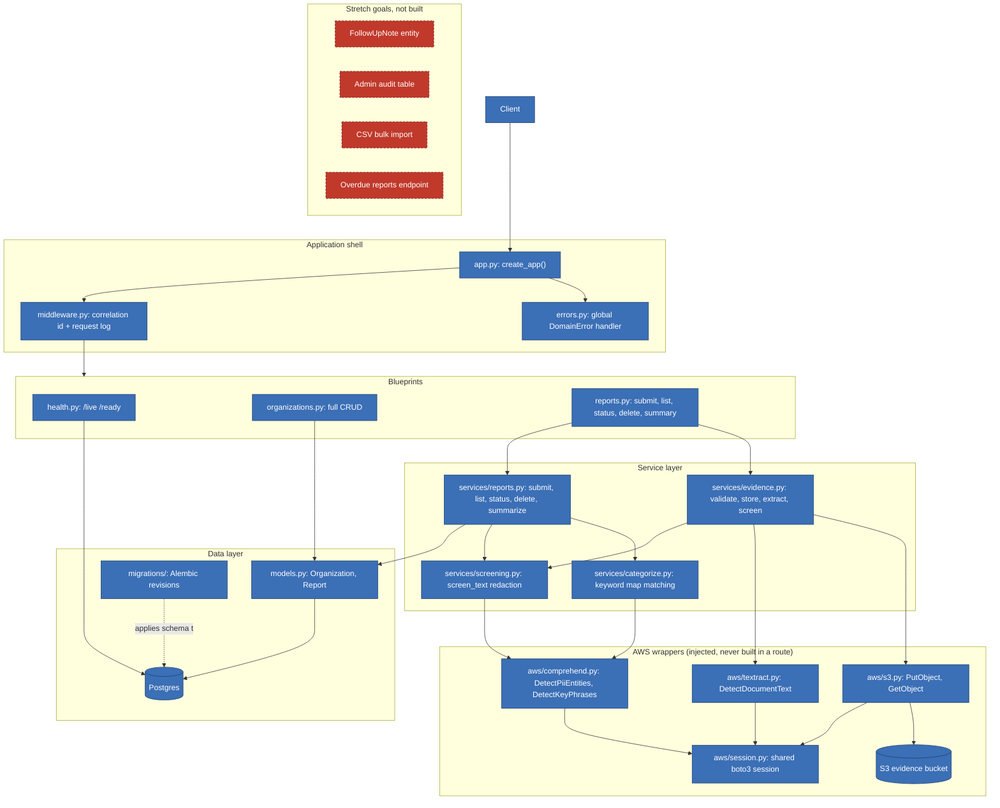

# Architecture

Blue is built and working. Red (dashed) is a stretch goal that was never
started. Every required piece of the project is blue.

Two things the arrows are meant to make obvious:

- `screening.py` is reached from two directions, the report body and the
  evidence text, and it is the same function both times. Evidence is not
  a way around redaction.
- Routes build a wrapper from `session.py` and hand it to a service. No
  route calls `boto3.client()`, which is what lets the whole AWS layer be
  swapped for doubles in the test suite.
