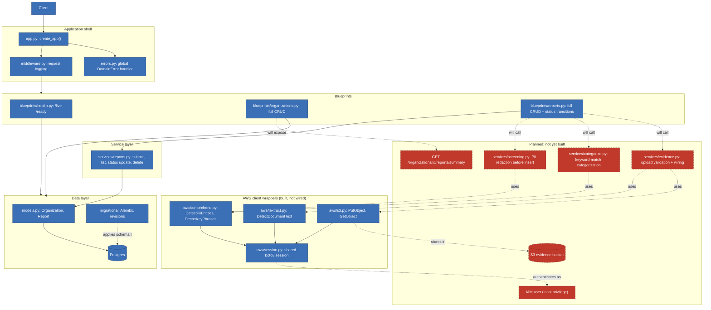

# Architecture: implemented vs planned

```mermaid
flowchart TB
    client[Client]

    subgraph shell["Application shell"]
        factory["app.py: create_app()"]
        mw["middleware.py: request logging"]
        errh["errors.py: global DomainError handler"]
    end

    subgraph routes["Blueprints"]
        health["blueprints/health.py: /live /ready"]
        orgs["blueprints/organizations.py: full CRUD"]
        reports["blueprints/reports.py: full CRUD + status transitions"]
    end

    subgraph svc["Service layer"]
        reportsvc["services/reports.py: submit, list, status update, delete"]
    end

    subgraph data["Data layer"]
        models["models.py: Organization, Report"]
        migrations["migrations/: Alembic revisions"]
        pg[("Postgres")]
    end

    subgraph awslayer["AWS client wrappers (built, not wired)"]
        session["aws/session.py: shared boto3 session"]
        comprehend["aws/comprehend.py: DetectPiiEntities, DetectKeyPhrases"]
        textract["aws/textract.py: DetectDocumentText"]
        s3["aws/s3.py: PutObject, GetObject"]
    end

    subgraph planned["Planned: not yet built"]
        screening["services/screening.py: PII redaction before insert"]
        categorize["services/categorize.py: keyword-match categorization"]
        evidence["services/evidence.py: upload validation + wiring"]
        summary["GET /organizations/id/reports/summary"]
        bucket[("S3 evidence bucket")]
        iamuser["IAM user (least privilege)"]
    end

    client --> factory
    factory --> mw --> routes
    factory --> errh
    health --> data
    orgs --> data
    reports --> reportsvc --> models
    models --> pg
    migrations -.applies schema to.-> pg

    reports -.will call.-> screening
    reports -.will call.-> categorize
    reports -.will call.-> evidence
    orgs -.will expose.-> summary

    screening -.uses.-> comprehend
    categorize -.uses.-> comprehend
    evidence -.uses.-> textract
    evidence -.uses.-> s3
    comprehend --> session
    textract --> session
    s3 --> session
    s3 -.stores in.-> bucket
    session -.authenticates as.-> iamuser

    classDef implemented fill:#3b6fb6,stroke:#1f3f6e,color:#ffffff
    classDef planned fill:#c0392b,stroke:#6e1f16,color:#ffffff,stroke-dasharray: 4 3

    class client,factory,mw,errh,health,orgs,reports,reportsvc,models,migrations,pg,session,comprehend,textract,s3 implemented
    class screening,categorize,evidence,summary,bucket,iamuser planned
```
