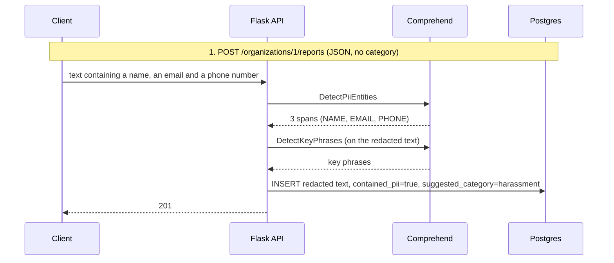
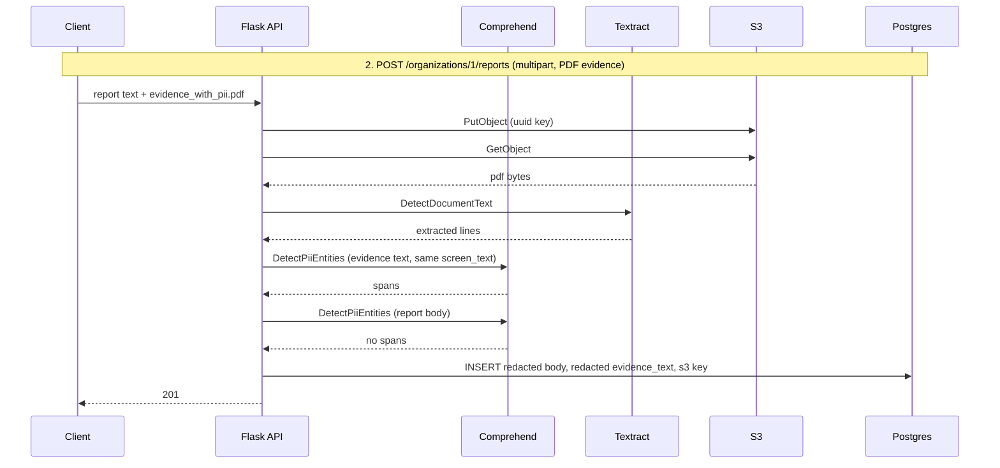
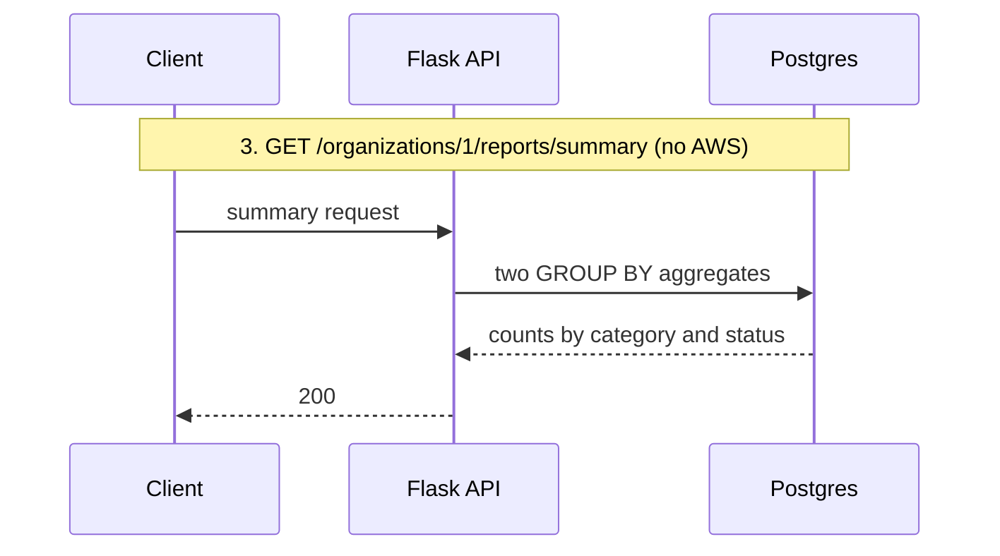

**1. POST /organizations/1/reports (JSON, no category)**

```mermaid
sequenceDiagram
    participant C as Client
    participant API as Flask API
    participant CP as Comprehend
    participant DB as Postgres

    Note over C,DB: 1. POST /organizations/1/reports  (JSON, no category)
    C->>API: text containing a name, an email and a phone number
    API->>CP: DetectPiiEntities
    CP-->>API: 3 spans (NAME, EMAIL, PHONE)
    API->>CP: DetectKeyPhrases (on the redacted text)
    CP-->>API: key phrases
    API->>DB: INSERT redacted text, contained_pii=true, suggested_category=harassment
    API-->>C: 201
```

**2. POST /organizations/1/reports (multipart, PDF evidence)**

```mermaid
sequenceDiagram
    participant C as Client
    participant API as Flask API
    participant CP as Comprehend
    participant TX as Textract
    participant S3 as S3
    participant DB as Postgres

    Note over C,DB: 2. POST /organizations/1/reports  (multipart, PDF evidence)
    C->>API: report text + evidence_with_pii.pdf
    API->>S3: PutObject (uuid key)
    API->>S3: GetObject
    S3-->>API: pdf bytes
    API->>TX: DetectDocumentText
    TX-->>API: extracted lines
    API->>CP: DetectPiiEntities (evidence text, same screen_text)
    CP-->>API: spans
    API->>CP: DetectPiiEntities (report body)
    CP-->>API: no spans
    API->>DB: INSERT redacted body, redacted evidence_text, s3 key
    API-->>C: 201
```

**3. GET /organizations/1/reports/summary (no AWS)**

```mermaid
sequenceDiagram
    participant C as Client
    participant API as Flask API
    participant DB as Postgres

    Note over C,DB: 3. GET /organizations/1/reports/summary  (no AWS)
    C->>API: summary request
    API->>DB: two GROUP BY aggregates
    DB-->>API: counts by category and status
    API-->>C: 200
```
