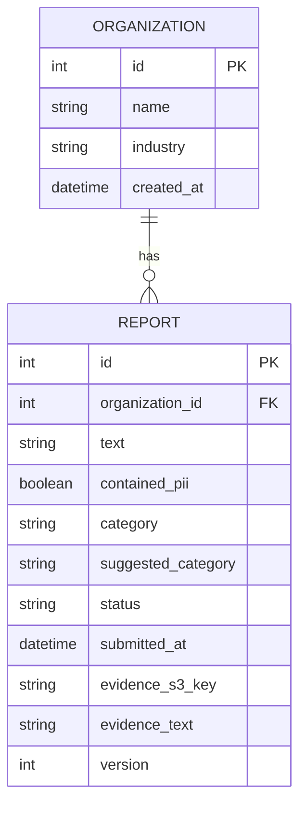

# Entity-Relationship Diagram

One organization has many reports; a report belongs to exactly one organization.

```mermaid
erDiagram
    ORGANIZATION ||--o{ REPORT : "has"

    ORGANIZATION {
        int id PK
        string name
        string industry
        datetime created_at
    }

    REPORT {
        int id PK
        int organization_id FK
        string text
        boolean contained_pii
        string category
        string suggested_category
        string status
        datetime submitted_at
        string evidence_s3_key
        string evidence_text
        int version
    }
```
