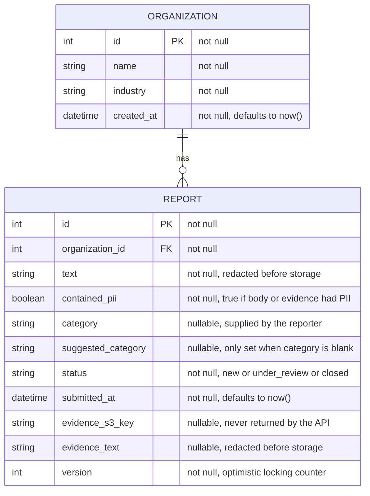

# Entity-Relationship Diagram

One organization has many reports; a report belongs to exactly one
organization. Deleting an organization deletes its reports (see
decisions.md).

```mermaid
erDiagram
    ORGANIZATION ||--o{ REPORT : "has"

    ORGANIZATION {
        int id PK "not null"
        string name "not null"
        string industry "not null"
        datetime created_at "not null, defaults to now()"
    }

    REPORT {
        int id PK "not null"
        int organization_id FK "not null"
        string text "not null, redacted before storage"
        boolean contained_pii "not null, true if body or evidence had PII"
        string category "nullable, supplied by the reporter"
        string suggested_category "nullable, only set when category is blank"
        string status "not null, new or under_review or closed"
        datetime submitted_at "not null, defaults to now()"
        string evidence_s3_key "nullable, never returned by the API"
        string evidence_text "nullable, redacted before storage"
        int version "not null, optimistic locking counter"
    }
```
