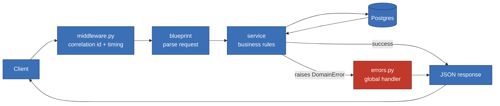

# Request flow

```mermaid
flowchart LR
    client[Client]
    mw["middleware.py\ncorrelation id + timing"]
    bp["blueprint\nparse request"]
    svc["service\nbusiness rules"]
    db[("Postgres")]
    err["errors.py\nglobal handler"]
    resp["JSON response"]

    client --> mw --> bp --> svc --> db
    db --> svc
    svc -- "raises DomainError" --> err
    svc -- "success" --> resp
    err --> resp
    resp --> client

    classDef implemented fill:#3b6fb6,stroke:#1f3f6e,color:#ffffff
    classDef error fill:#c0392b,stroke:#6e1f16,color:#ffffff
    class client,mw,bp,svc,db,resp implemented
    class err error
```
