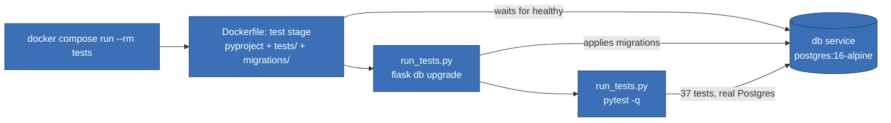
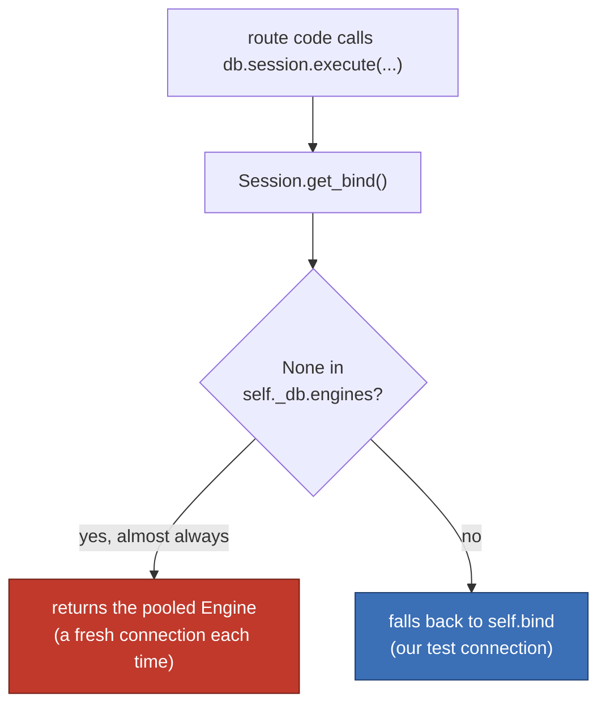

# Test container and rollback-per-test





```python
connection = _db.engine.connect()
transaction = connection.begin()

real_engine = _db.engines[None]
_db.engines[None] = connection          # get_bind() now hands out our connection

old_session = _db.session
_db.session = _db._make_scoped_session(
    options={"bind": connection, "join_transaction_mode": "create_savepoint"}
)

yield  # the test runs here

_db.session.remove()
transaction.rollback()                  # undoes everything, no matter how many commits happened
connection.close()
_db.session = old_session
_db.engines[None] = real_engine
```
